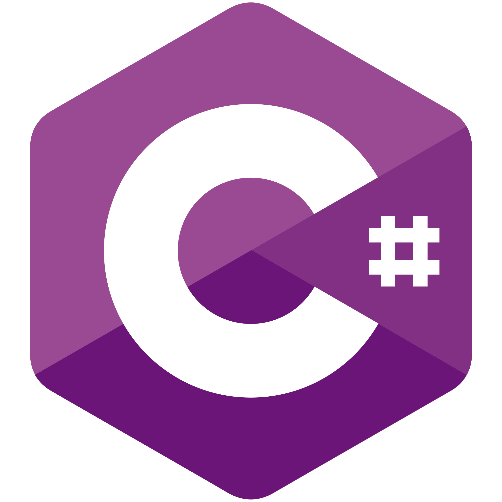

                              

 <pre style="white-space: pre-wrap;">
                                ___   _      ___   _      ___   _      ___   _      ___   _
                               [(_)] |=|    [(_)] |=|    [(_)] |=|    [(_)] |=|    [(_)] |=|
                                '-`  |_|     '-`  |_|     '-`  |_|     '-`  |_|     '-`  |_|                                              
                               /mmm/  /     /mmm/  /     /mmm/  /     /mmm/  /     /mmm/  /
                                     |____________|____________|____________|____________|
                                                           |            |            |
                                                       ___  \_      ___  \_      ___  \_
                                                      [(_)] |=|    [(_)] |=|    [(_)] |=|
                                                       '-`  |_|     '-`  |_|     '-`  |_|
                                                      /mmm/        /mmm/        /mmm/
</pre>

<pre style="white-space: pre-wrap;">
┌──┤ WHOAMI ├─────────▰▰▰                         
│    
│    Hey there! I'm a Python Developer with a deep passion for Linux, Cybersecurity,      
│    Networking, and System Administration.         
│    I love diving into open-source, crafting secure systems, and automating with Python.
│
└───────────────────────────────▰▰▰
</pre>

<pre style="white-space: pre-wrap;">
┌──┤ MY MOTIVATION ├─────────▰▰▰
│
├─◈    💻 Linux Enthusiast – Tweaking, optimizing, and securing systems is my thing.  
├─◈    🛡️ Cybersecurity Explorer – Always learning, always securing. 
├─◈    🌐 Network & System Admin – Keeping the digital world connected and running smoothly.
├─◈    🐍 Python Developer – Automating the boring stuff and building cool things.
│
└───────────────────────────────▰▰▰
</pre>

<pre style="white-space: pre-wrap;">
┌──┤ 🚀 PROJECTS ├──────────────▰▰▰
│
├─◈ 🧩 Console Applications 
│  
│
├─◈ 🔐 Basic Password Manager 
│ 
│
├─◈ 🌐  FisiltiWeb
│
└────────────────────────────────▰▰▰
</pre>

<!-- Teknik Stack -->

  
  
  
  
  
  
  
  

  <!-- ✅ After Effects -->

  
  <!-- ✅ Photoshop -->
  

  <!-- ✅ Premiere Pro -->
  

  

